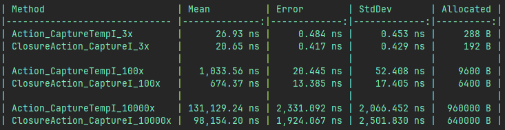

# Closures
Closure structs that capture a context and a delegate that is invoked with the given context.

```csharp
using Closures;

var closure = Closure.Action(100, (context) => $"Captured context {context}");
Console.WriteLine(closure.Invoke()); // Output: Captured context 100
```
## Installation
You can install the Closures library via NuGet Package Manager:

```bash
Install-Package Closures
```
Or by using the .NET CLI:

```bash
dotnet add package Closures
```

Performance benchmarks of the below code using closures vs capturing variables
in a lambda expression show significant improvements in execution time and memory allocation.



## Why?
Due to the nature of closures, 
the context is captured as reference.

The following code might not work as expected:
```csharp
List<Action> actions = new List<Action>();

for (int i = 0; i < 3; i++) {
    var action = new Action(() => Console.WriteLine($"{i}"));
    actions.Add(action);
}

foreach (var action in actions) {
    action.Invoke(); // Output: 3, 3, 3
}
```
You would see the output as `3, 3, 3`
because the variable `i` is captured by reference,
and by the time the actions are invoked,
`i` has already reached its final value of `3`.

To fix this, you can capture the current value of `i` in a separate variable in each iteration:
```csharp
List<Action> actions = new List<Action>();

for (int i = 0; i < 3; i++) {
    var tempI = i; // Capture the current value of i
    var action = new Action(() => Console.WriteLine($"{tempI}"));
    actions.Add(action);
}

foreach (var action in actions) {
    action.Invoke(); // Output: 0, 1, 2
}
```
You would see the output as `0, 1, 2` Though this works, it allows `tempI` to be captured by the lambda escaping its scope,
creating a closure allocation capture that is allocated on the heap.

To avoid this overhead, you can use `Closure` structs:
```csharp
using Closures;

List<ClosureAction<int>> actions = new List<ClosureAction<int>>();

for (int i = 0; i < 3; i++) {
    // Create a closure that captures the current value of i
    var action = Closure.Action(i, (context) => Console.WriteLine($"{context}"));
    actions.Add(closure);
}

foreach (var action in actions) {
    action.Invoke(); // Output: 0, 1, 2
}
```
This way, you avoid unnecessary heap allocations when capturing variables, 
which in turn reduces garbage collection overhead.
This is especially beneficial in performance-critical scenarios, such as game development,
where minimizing allocations and maximizing efficiency is crucial.


Closures Explained: [Closures | In 210 Seconds](https://youtu.be/jHd0FczIjAE?si=5slaULcQxYZN3EES)<br>
Video demonstration of a similar concept: [Fix Closure Issues in 10 Minutes and Boost Performance](https://youtu.be/xiz24OqwEVI?si=gUapklV8JF0FaLTm)

## Usage
To use the closures, simply create an instance of the desired closure type using the `Closure.Action` or `Closure.Func` methods, passing in the context and the delegate to be invoked. The closures can then be invoked like any other delegate.

### Basic closures
- `ClosureAction<string>` that captures a string context.
- `ClosureFunc<int, int>` that captures an integer context and returns a doubled value.

```csharp
using Closures;

// Example of ClosureAction
var closureAction = Closure.Action("captured context", (string context) => Console.WriteLine($"Action with context - {context}"));
closureAction.Invoke(); // Output: Action with context - captured context

// Example of ClosureFunc
var closureFunc = Closure.Func(10, (int context) => context * 2);
Console.WriteLine(closureFunc.Invoke()); // Output: 20
```

### Mutating closures
Mutating closures allow you to modify the captured context within the delegate. 
They are useful when you want to change the state of the context variable during the closure's execution.
Or when you want to invoke the closure multiple times with the context being modified each time.

- `MutatingClosureAction<int>` that captures a mutable context.
- `MutatingClosureFunc<int, int>` that captures a mutable context and returns the sum of modifications.

```csharp
using Closures;

// Example of MutatingClosureAction
var mutatingContext = 10;
var mutatingClosureAction = Closure.Action(mutatingContext, (ref int context) => {
    Console.WriteLine(context)
    context += 5
});
mutatingClosureAction.AddAction((ref int context) => Console.WriteLine(context));
mutatingClosureAction.Invoke(); // Output: 10, 15

// Example of MutatingClosureFunc
var mutatingFuncContext = 20;
var mutatingClosureFunc = Closure.Func(mutatingFuncContext, (ref int context) => context *= 2);
mutatingClosureFunc.AddFunc((ref int context) => context += 10);
Console.WriteLine(mutatingClosureFunc.Invoke()); // Output: 50
```
`MutatingContextBehaviour`
allows you to define whether the context should be reset to the initial value 
or retain its modified state after invocation.

`MutatingContextBehaviour` has two options: `Retain` and `Reset`.
The default behavior is `Retain`, meaning the context will keep its modified state after the closure is invoked.

```csharp
using Closures;

// Example of MutatingContextBehaviour.Retain
var mutatingContext = 10;
var mutatingClosureRetain = Closure.Action(mutatingContext, (ref int context) => {
    Console.WriteLine($"{context}");
    context += 5
    Console.WriteLine($"{context}");
}, MutatingContextBehaviour.Retain);

mutatingClosureRetain.Invoke(); // Output: 10, 15
console.WriteLine($"{mutatingClosureRetain.Context}"); // Output: 15

// Example of MutatingContextBehaviour.Reset
var mutatingContext = 10;
var mutatingClosureReset = Closure.Action(mutatingContext, (ref int context) => {
    Console.WriteLine($"{context}");
    context += 5
    Console.WriteLine($"{context}");
}, MutatingContextBehaviour.Reset);

mutatingClosureReset.Invoke(); // Output: 10, 15
Console.WriteLine($"{mutatingClosureReset.Context}"); // Output: 10
```

### Ref closures
Ref closures are ref structs that capture a reference to a context variable, allowing it to modify the original reference.

- `RefActionClosure<int>` that captures a reference to a mutable context.
- `RefFuncClosure<int, int>` that captures a reference to a mutable context and returns a modified value.

```csharp
using Closures;

// Example of RefActionClosure
var refContext = 30;
var RefClosureAction = Closure.Action(ref refContext, (ref int context) => {
    Console.WriteLine(context);
    context += 10;
});

RefClosureAction.Invoke(); // Output: 30
Console.WriteLine(refContext); // Output: 40

// Example of RefFuncClosure
var refClosureFunc = 40;
var passedRefFuncClosure = Closure.Func(ref refFuncContext, (ref int context) => {
    context *= 2;
    return context * 2;
});

Console.WriteLine(refClosureFunc.Invoke()); // Output: 160
Console.WriteLine(refFuncContext); // Output: 80
```

### Closures with an argument
Any closure can also accept an argument when invoked.

- `ClosureAction<TContext, TArg>` that captures a string context and is called with an int argument.
- `FuncClosure<TContext, TArg, TResult>` that captures an integer context, is called with an int argument and returns the sum of the context and argument.

```csharp
using Closures;
// Example of ActionClosure with an argument
var closureActionWithArg = Closure.Action(10, (int context, int arg) => Console.WriteLine($"Context {context}, Arg: {arg}"));
closureActionWithArg.Invoke(5); // Output: Context: 10, Arg: 5

// Example of ClosureFunc with an argument
var closureFuncWithArg = Closure.Func(10, (int context, int arg) => context + arg);
Console.WriteLine(closureFuncWithArg.Invoke(5)); // Output: 15
```

## Closure Types

### Action Closures
- `ClosureAction<TContext>`: Captures a context of type `TContext` and invokes an action with that context.
   <br><br>
- `ClosureAction<TContext, TArg>`: Captures a context of type `TContext` and invokes an action with an argument of type `TArg`.
   <br><br>
- `ClosureRefAction<TContext, TArg>`: Captures a context of type `TContext` and invokes an action with a ref argument of type `TArg`.
   <br><br>
- `MutatingClosureAction<TContext>`: Captures a context of type `TContext` by value and invokes a ref action that can mutate the stored context.
  <br><br>
- `MutatingClosureAction<TContext, TArg>`: Captures a context of type `TContext` by value and invokes an action with an argument, allowing mutation of the stored context.
  <br><br>
- `MutatingClosureRefAction<TContext, TArg>`: Captures a context of type `TContext` by value and invokes a ref action with a ref argument, allowing mutation of both context and argument.
  <br><br>
- `RefClosureAction<TContext>`: Captures a reference to a context variable of type `TContext` and invokes a ref action, mutating the original variable.
  <br><br>
- `RefClosureAction<TContext, TArg>`: Captures a reference to a context variable and invokes an action with an argument, mutating the original variable.
  <br><br>
- `RefClosureRefAction<TContext, TArg>`: Captures a reference to a context variable and invokes a ref action with a ref argument, mutating both.

### Function Closures
- `ClosureFunc<TContext, TResult>`: Captures a context of type `TContext` and invokes a function returning `TResult`.
  <br><br>
- `ClosureFunc<TContext, TArg, TResult>`: Captures a context of type `TContext` and invokes a function with an argument, returning `TResult`.
  <br><br>
- `ClosureRefFunc<TContext, TArg, TResult>`: Captures a context of type `TContext` and invokes a function with a ref argument, returning `TResult`.
  <br><br>
- `MutatingClosureFunc<TContext, TResult>`: Captures a context of type `TContext` by value and invokes a ref function, allowing mutation of the stored context.
  <br><br>
- `MutatingClosureFunc<TContext, TArg, TResult>`: Captures a context of type `TContext` by value and invokes a function with an argument, allowing mutation of the stored context.
  <br><br>
- `MutatingClosureRefFunc<TContext, TArg, TResult>`: Captures a context of type `TContext` by value and invokes a ref function with a ref argument, allowing mutation of both context and argument.
  <br><br>
- `RefClosureFunc<TContext, TResult>`: Captures a reference to a context variable and invokes a ref function, mutating the original variable.
  <br><br>
- `RefClosureFunc<TContext, TArg, TResult>`: Captures a reference to a context variable and invokes a function with an argument, mutating the original variable.
  <br><br>
- `RefClosureRefFunc<TContext, TArg, TResult>`: Captures a reference to a context variable and invokes a ref function with a ref argument, mutating both.

## License
This project is licensed under the MIT License.